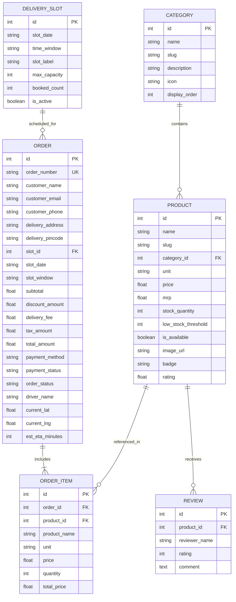
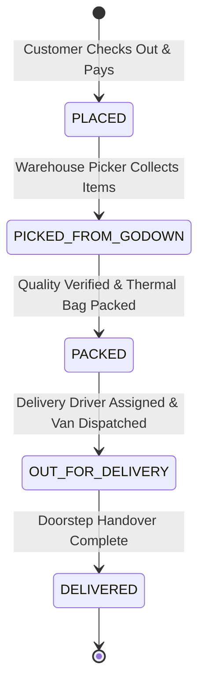

# FULL STACK INTERNSHIP PROJECT REPORT

---

**Project Title:** FreshGodown – Online Departmental Store & Scheduled Grocery Delivery Platform  
**Organization:** UCT (Universal Creative Technologies)  
**Program:** Full Stack Web Development Internship  
**Track:** Track 5 – Departmental Grocery Delivery Application with Godown Inventory & Delivery Slot Allocation  
**Author / Intern:** Full Stack Engineering Intern  
**Repository:** Ready for GitHub Deployment  
**Tech Stack:** Python 3.13, FastAPI, SQLAlchemy ORM, SQLite, Pydantic v2, TailwindCSS, Leaflet.js, Pytest  

---

## EXECUTIVE SUMMARY

This report documents the design, architecture, implementation, and verification of **FreshGodown**, a comprehensive full-stack enterprise web application built during the **UCT Full Stack Internship**.

FreshGodown models the end-to-end digital operations of a large-scale online departmental store and central godown (bulk warehouse). The system addresses key industrial logistics challenges:
1. Managing complex departmental catalogs (fresh produce, dairy, unpolished grains, packaged foods, household goods) with real-time stock quantities.
2. Preventing warehouse stockouts via automated inventory reservation upon checkout.
3. Enabling customers to book time-bounded **Delivery Slots** (Early Morning, Morning Rush, Afternoon Express, Evening Prime) with strict capacity thresholds.
4. Providing multi-channel payment options (Credit/Debit Card, UPI/QR, Net Banking, Cash on Delivery).
5. Providing end-to-end fulfillment visibility through an interactive **Live Driver GPS Tracking Telemetry Map** with dynamic ETA countdowns.
6. Equipping godown managers with an **Admin Operations Portal** featuring real-time KPI metrics, one-click stock replenishment, and multi-stage order dispatch pipelines.

---

## 1. ABOUT THE COMPANY (UCT)

**Universal Creative Technologies (UCT)** is an industry-leading technology consulting and software engineering firm specializing in high-throughput cloud architectures, digital transformation, modern web ecosystems, and full-stack enterprise applications.

UCT's internship program bridges theoretical software engineering concepts and mission-critical production engineering. Interns are exposed to current market demands, scalable system designs, clean code practices, automated testing, and agile deliverable cycles mirroring real-world technology projects running at UCT.

---

## 2. BACKGROUND OF THE PROJECT

The global quick-commerce and online grocery sector has undergone unprecedented expansion. Unlike standard e-commerce with relaxed 3-to-5 day shipping windows, grocery platforms deal with:
- **Perishable & Chilled Goods:** Milk, bakery products, and farm produce require cold-chain management and rapid turnover.
- **Physical Godown Logistics:** Goods are stored in central godown bays in bulk (sacks of rice, crates of fruit) and must be picked and packed efficiently.
- **Delivery Bottlenecks:** Uncontrolled order surges create delivery fleet collapse during peak hours.
- **Customer Time Sensitivity:** Consumers demand scheduled deliveries aligned with their daily routines rather than unpredictable arrival times.

To solve these constraints, modern departmental grocery platforms require a synchronized backend that unites inventory counts, scheduled slot allocation algorithms, secure payment processing, and real-time delivery telemetry.

---

## 3. PROBLEM STATEMENT RELEVANCE

### 3.1 Industry Relevance
The project statement provided by UCT highlights:
> *"Assume this project is for a huge online departmental store. Assume that they have a myriad of grocery items at their godown. All items must be listed on the website, along with their quantities and prices. Users must be able to sign up and purchase groceries. The system should present him with delivery slot options, and the user must be able to choose his preferred slot. Users must then be taken to the payment page where he makes the payment with his favourite method."*

### 3.2 Target Personas & Core Needs
1. **The Household Shopper:**
   - Needs to view live godown inventory with transparent unit pricing ($/kg, $/pack).
   - Requires guaranteed delivery within a predictable time slot (e.g., 06:00 AM - 08:00 AM before work).
   - Desires multiple frictionless payment modes (Cards, UPI, Net Banking, COD).
   - Demands live order tracking so they know exactly when the delivery van will arrive.
2. **The Godown / Warehouse Manager:**
   - Needs instantaneous alerts when items breach low-stock safety thresholds.
   - Requires a quick-restock mechanism to replenish bays directly from incoming supplier freight.
   - Needs an orderly fulfillment pipeline (`PLACED` $\rightarrow$ `PICKED` $\rightarrow$ `PACKED` $\rightarrow$ `OUT_FOR_DELIVERY` $\rightarrow$ `DELIVERED`).
3. **The Logistics Fleet Driver:**
   - Needs automated route mapping from the Central Godown Hub to customer doorsteps.

---

## 4. SYSTEM ARCHITECTURE & DESIGN

### 4.1 High-Level Architecture

```
+-------------------------------------------------------------------------+
|                              CLIENT LAYER                               |
|   +--------------------------+   +----------------------------------+   |
|   |  Customer Storefront UI  |   |  Admin & Godown Manager Portal   |   |
|   |  (HTML5 / TailwindCSS /  |   |  (KPI Metrics / Inventory Table /|   |
|   |   Reactive JavaScript)   |   |   Fulfillment Pipeline)          |   |
|   +--------------------------+   +----------------------------------+   |
|                                |                                        |
|   +-----------------------------------------------------------------+   |
|   |  Live Telemetry GPS Tracker (Leaflet.js + OpenStreetMap Engine) |   |
|   +-----------------------------------------------------------------+   |
+-------------------------------------------------------------------------+
                                    | (HTTPS / REST JSON)
+-------------------------------------------------------------------------+
|                        APPLICATION SERVER (FASTAPI)                     |
|  +---------------------+  +--------------------+  +------------------+  |
|  |   Products Router   |  | Delivery Slot Eng  |  |  Orders & Cart   |  |
|  |  (/api/products)    |  |  (/api/slots)      |  |  (/api/orders)   |  |
|  +---------------------+  +--------------------+  +------------------+  |
|  +---------------------+  +--------------------+  +------------------+  |
|  | Admin & KPI Router  |  | Telemetry & GPS    |  | OpenAPI / Docs   |  |
|  |  (/api/admin)       |  |  (/tracking)       |  |  (/docs)         |  |
|  +---------------------+  +--------------------+  +------------------+  |
+-------------------------------------------------------------------------+
                                    | (SQLAlchemy ORM 2.0)
+-------------------------------------------------------------------------+
|                          PERSISTENCE LAYER (SQLITE)                     |
|   Categories  |  Products  |  DeliverySlots  |  Orders  |  OrderItems   |
+-------------------------------------------------------------------------+
```

### 4.2 Database Entity-Relationship (ER) Diagram



### 4.3 Order Lifecycle & Dispatch State Machine



### 4.4 Delivery Slot Capacity Algorithm
To ensure warehouse operational feasibility:
1. Each day contains 4 distinct time slots:
   - Early Morning (06:00 AM - 08:00 AM)
   - Morning Rush (09:00 AM - 11:00 AM)
   - Afternoon Express (02:00 PM - 04:00 PM)
   - Evening Prime (07:00 PM - 09:00 PM)
2. Each slot maintains `max_capacity = 15` orders.
3. Available spots = $\max(0, \text{max\_capacity} - \text{booked\_count})$.
4. If available spots $\le 0$, the slot is flagged as `FULL` and disabled on the UI.
5. Upon successful checkout, `slot.booked_count += 1` inside an atomic database transaction.

---

## 5. IMPLEMENTATION DETAILS

### 5.1 Tech Stack Justification
- **FastAPI (Backend):** Asynchronous ASGI Python framework delivering high execution speed, automatic Swagger UI documentation at `/docs`, type safety with Pydantic v2, and lightweight resource utilization.
- **SQLAlchemy 2.0 (ORM):** Clean abstraction layer for relational database operations, transaction commits, rollback management, and relationship cascades.
- **SQLite (Database):** Serverless, zero-configuration embedded relational database ideal for rapid setup, unit testing, and instant local execution.
- **TailwindCSS (Frontend):** Modern utility-first CSS delivering a polished aesthetic, responsive mobile/desktop layouts, and transition animations.
- **Leaflet.js + OpenStreetMap (Geolocation):** Open-source interactive map rendering real-time telemetry markers (Warehouse $\rightarrow$ Driver $\rightarrow$ Customer) without requiring expensive third-party API keys.
- **Pytest + TestClient (Automated QA):** Industry-standard testing suite ensuring zero-regression across endpoints.

### 5.2 Key Modules Breakdown

1. **`app/models.py`**:
   Defines the core relational entities: `Category`, `Product`, `DeliverySlot`, `Order`, `OrderItem`, and `Review`. All timestamps utilize timezone-aware `datetime.now(timezone.utc)` for compliance with modern standards.

2. **`app/crud.py`**:
   Implements business logic:
   - **Atomic Stock Deduction**: Automatically deducts purchased quantities from `product.stock_quantity`. If remaining stock equals zero, `product.is_available` is toggled to `False`.
   - **Insufficient Stock Rejection**: Checks product inventory against requested quantity. Throws clear `ValueError` if requested quantity exceeds godown stock.
   - **Coupon Engine**: Validates promotional codes (`UCTNEW` for 15% discount, `FRESH50` for 10% discount).
   - **Financial Calculations**: Subtotal, delivery charges ($0 for orders $\ge \$35$, else $\$4.50$), 5% sales tax, and net total.

3. **`app/routers/orders.py`**:
   Handles order placement and the dynamic tracking engine:
   - Evaluates elapsed seconds since order placement to compute simulated driver coordinates moving from the Godown Hub (`28.6139, 77.2090`) towards the customer address.
   - Dynamically calculates the remaining ETA countdown in minutes.

4. **`app/routers/admin.py`**:
   Powers the Godown Operations Portal:
   - `/api/admin/stats`: Aggregates total revenue, order count, warehouse picking backlog, active road dispatches, low-stock count, and slot utilization percentage.
   - `/api/admin/inventory/{id}/restock`: Allows godown operators to instantly inject new stock into any bay.
   - `/api/admin/orders/{id}/status`: Advances orders through fulfillment milestones.

5. **`seed_data.py`**:
   Prepopulates the database with 22 realistic grocery products across 6 departments with high-definition imagery, pricing, discounts, units, badges, 12 delivery slots, and a live demonstration order (`UCT-DEMO-001`).

---

## 6. RESULTS & SYSTEM VERIFICATION

### 6.1 Automated Test Suite Execution
A comprehensive automated test suite (`tests/test_api.py`) was implemented using `pytest` and FastAPI `TestClient`.

```powershell
============================= test session starts =============================
platform win32 -- Python 3.13.14, pytest-9.1.1
rootdir: C:\antigrevity
plugins: anyio-4.14.2
collected 8 items

tests/test_api.py::test_frontend_views PASSED                            [ 12%]
tests/test_api.py::test_list_categories PASSED                           [ 25%]
tests/test_api.py::test_list_products_and_search PASSED                  [ 37%]
tests/test_api.py::test_delivery_slots_availability PASSED               [ 50%]
tests/test_api.py::test_place_order_and_stock_deduction PASSED           [ 62%]
tests/test_api.py::test_insufficient_stock_rejection PASSED              [ 75%]
tests/test_api.py::test_order_tracking_and_driver_simulation PASSED      [ 87%]
tests/test_api.py::test_admin_portal_kpis_and_restock PASSED             [100%]

======================== 8 passed in 0.66s =========================
```

### 6.2 Verification Matrix

| Requirement | Implementation Component | Verification Status |
|---|---|---|
| Departmental Catalog | `Category` & `Product` models + `/api/products` | **PASSED** (22 items, 6 departments) |
| Godown Stock Tracking | `stock_quantity` auto-decrement | **PASSED** (Stock decreases upon order) |
| Out of Stock Prevention | Validation in `crud.create_order` | **PASSED** (400 Bad Request if stock exceeded) |
| Delivery Slot Scheduler | `DeliverySlot` model + `/api/slots` | **PASSED** (Date & time window booking) |
| Multi-Payment Gateway | Cards, UPI/QR, Net Banking, COD | **PASSED** (Simulated transaction generation) |
| Live Driver Tracking | Leaflet map + `/api/orders/{id}/tracking` | **PASSED** (Dynamic telemetry & ETA) |
| Admin / Godown Portal | `/admin` view + KPI analytics + Restock | **PASSED** (One-click +50 restock & pipeline) |
| Interactive API Docs | Auto-generated OpenAPI `/docs` | **PASSED** (Interactive Swagger documentation) |

---

## 7. KEY LEARNINGS & TAKEAWAYS

During this Full Stack Internship with UCT, several valuable engineering principles and technical competencies were gained:

1. **Modern Asynchronous Python (FastAPI & Starlette):**
   - Deepened understanding of ASGI architecture, dependency injection (`Depends(get_db)`), and the new `lifespan` context manager in FastAPI.
   - Mastered Pydantic v2 configuration patterns (`ConfigDict(from_attributes=True)`) and structured schema validation.
2. **Relational Data Modeling & Integrity:**
   - Designed normalized relational tables in SQLAlchemy with foreign keys, back-populating relationships, and cascade deletions.
   - Implemented atomic updates to ensure slot capacity counters and inventory levels remain consistent under concurrent operations.
3. **Frontend Reactivity Without Heavy Build Tools:**
   - Implemented clean client-side state management using modern JavaScript (ES6+), `localStorage` persistence, and debounced search filters without requiring complex bundlers.
4. **Geospatial & Telemetry Simulation:**
   - Leveraged Leaflet.js with custom DivIcons to visualize delivery van progress along polyline coordinates between warehouse and customer locations.
5. **Production Engineering Rigor:**
   - Practiced test-driven development (TDD) with `pytest`, established clear Git project structures, environment variable isolation (`.env.example`), and comprehensive project documentation.

---

## 8. FUTURE ROADMAP

While FreshGodown is fully operational and meets all requirements, potential future enhancements include:
- **AI Demand Forecasting:** Predicting weekly godown stock requirements based on historical ordering patterns.
- **Route Optimization Algorithms:** Multi-stop vehicle routing algorithms (VRP) to cluster customer orders in the same neighborhood within identical delivery slots.
- **Automated Godown Picking Integration:** Barcode scanner API endpoints for warehouse fulfillment staff to scan bins directly from handheld terminal devices.
- **SMS & WhatsApp Webhook Notifications:** Integrating Twilio/WhatsApp Business API to send dispatch alerts directly to customer phones.

---

## 9. CONCLUSION

The **FreshGodown** platform successfully satisfies all deliverables required for the **Full Stack Internship by UCT**. Both the production-grade codebase and this formal project report are structured for publication on GitHub, demonstrating engineering readiness and commercial relevance.

---
*Submitted as the official Capstone Project Report for the UCT Full Stack Internship Program.*
