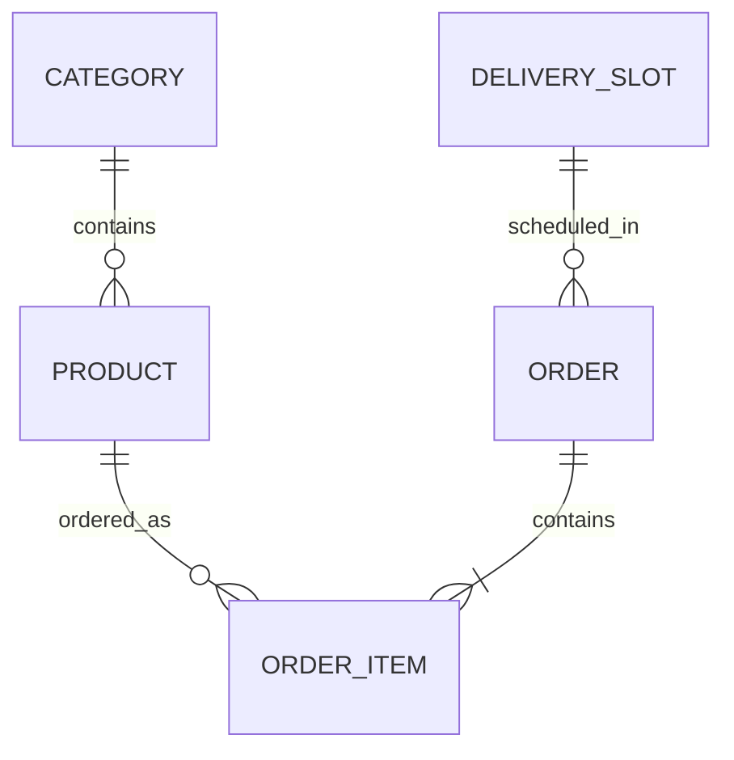

# FreshGodown 🥬 – Online Departmental Store & Grocery Delivery Platform

[](https://www.python.org/)
[](https://fastapi.tiangolo.com/)
[](https://tailwindcss.com/)
[](https://www.sqlalchemy.org/)
[](https://pytest.org/)
[](#)

> **Official Capstone Project for the Full Stack Internship by UCT (Universal Creative Technologies)**  
> **Project Track 5:** Departmental Grocery Delivery Application with Central Godown Inventory & Delivery Slot Allocation.

---

## 📋 Table of Contents
- [Project Overview](#-project-overview)
- [Key Features](#-key-features)
- [System Architecture](#-system-architecture)
- [Quick Start Guide](#-quick-start-guide)
- [Application Portals](#-application-portals)
- [API Documentation](#-api-documentation)
- [Automated Testing](#-automated-testing)
- [Deliverables & Project Report](#-deliverables--project-report)

---

## 🌟 Project Overview

**FreshGodown** is an enterprise-grade full-stack web application designed for a large online departmental store operating a centralized warehouse (godown).

The platform addresses industrial logistics and customer experience requirements:
1. **Central Godown Inventory**: Transparent stock quantities across 6 departments with automated stock reservation upon checkout.
2. **Delivery Slot Scheduler**: Capacity-regulated delivery windows (Early Morning, Morning Rush, Afternoon Express, Evening Prime) with real-time slot occupancy tracking.
3. **Multi-Method Payment Gateway**: Simulated Credit/Debit Card, UPI/QR code, Net Banking, and Cash on Delivery (COD).
4. **Live Driver Telemetry & GPS Tracking**: Interactive Leaflet.js map with animated delivery van tracking and dynamic ETA countdowns.
5. **Godown Operations Portal**: Real-time KPI dashboard, one-click inventory restock, and multi-stage order fulfillment pipelines.

---

## 🚀 Key Features

### 🛒 Customer Storefront
- **Departmental Catalog**: Fresh Produce, Dairy & Bakery, Godown Staples & Grains, Beverages, Gourmet Snacks, Household Supplies.
- **Smart Filtering & Search**: Instant debounced search, category filter pills, price/rating sorting, and "In-Stock Only" toggle.
- **Persistent Shopping Cart**: Session & `localStorage` backed cart with dynamic delivery fee calculations (Free delivery over \$35), GST calculations, and promo code engine (`UCTNEW` for 15% off).
- **Scheduled Slot Selection**: 4 daily delivery slots with live capacity counters preventing overbooking.
- **Multi-Channel Checkout**: Integrated payment simulator with digital order receipts and instant tracking links.

### 📍 Live Delivery Tracking & GPS Telemetry
- **Interactive OpenStreetMap (Leaflet.js)** showing route from Central Godown Hub $\rightarrow$ Delivery Van $\rightarrow$ Customer Destination.
- **Dynamic ETA Countdown**: Automatically estimates remaining minutes based on fulfillment progress.
- **5-Stage Order Lifecycle**: `PLACED` $\rightarrow$ `PICKED_FROM_GODOWN` $\rightarrow$ `PACKED` $\rightarrow$ `OUT_FOR_DELIVERY` $\rightarrow$ `DELIVERED`.
- **Driver Contact Card**: Assigned delivery executive details, electric cargo vehicle info, and direct phone link.

### 🏢 Godown Manager & Admin Portal
- **Executive KPI Cards**: Total Revenue, Total Orders, Items in Godown bays, Low-Stock alerts, and Slot utilization rate.
- **Fulfillment Pipeline**: Table of active orders with dropdown actions to advance status.
- **Inventory & Stock Control**: Real-time stock counts with color-coded alerts and `+50 Quick Restock` triggers.

---

## 🏗️ System Architecture

```
FreshGodown Architecture
├── Client Layer (HTML5, TailwindCSS, Alpine/Vanilla JS, Leaflet.js)
├── Application Layer (FastAPI ASGI Framework, Pydantic v2 validation)
├── Relational ORM Layer (SQLAlchemy 2.0 ORM with relational cascades)
└── Database Layer (SQLite / PostgreSQL compatible)
```



---

## ⚡ Quick Start Guide

### Prerequisites
- **Python 3.10+** (Tested on Python 3.13)
- `pip` package manager

### 1. Clone & Navigate to Repository
```bash
git clone https://github.com/your-username/freshgodown-uct.git
cd freshgodown-uct
```

### 2. Install Dependencies
```bash
python -m pip install -r requirements.txt
```

### 3. Launch Application
Simply run the single entrypoint script:
```bash
python run.py
```
*(The system will automatically initialize the SQLite database and seed 22 departmental products, 12 delivery slots, and a demonstration tracking order if the database is empty).*

---

## 🌐 Application Portals

Once the server is running, open your web browser to:

| Portal | URL | Description |
|---|---|---|
| **Customer Storefront** | [http://127.0.0.1:8000/](http://127.0.0.1:8000/) | Browse godown goods, cart drawer, slot picker, checkout |
| **Live Driver GPS Tracking** | [http://127.0.0.1:8000/track/UCT-DEMO-001](http://127.0.0.1:8000/track/UCT-DEMO-001) | Real-time map telemetry, driver simulation & dynamic ETA |
| **Godown Manager Dashboard** | [http://127.0.0.1:8000/admin](http://127.0.0.1:8000/admin) | Fulfillment pipeline, KPI analytics, inventory stock control |
| **Interactive API Docs** | [http://127.0.0.1:8000/docs](http://127.0.0.1:8000/docs) | Swagger UI for testing all REST endpoints |

---

## 📡 API Documentation

FastAPI automatically generates interactive Swagger documentation accessible at `/docs`.

### Key Endpoints:
- `GET /api/categories`: List all 6 departmental categories with product counts.
- `GET /api/products`: Filterable product catalog (`category_id`, `search`, `in_stock_only`, `sort_by`).
- `GET /api/products/{id}`: Product details with unit, MRP, stock count, and reviews.
- `GET /api/slots`: View delivery slot availability with spot calculations.
- `POST /api/orders`: Place order (validates stock, deducts godown inventory, books slot spot).
- `GET /api/orders/{order_number}`: Retrieve full order details and breakdown.
- `GET /api/orders/{order_number}/tracking`: Live telemetry data with dynamic driver GPS coordinates.
- `GET /api/admin/stats`: Godown operational KPIs (revenue, active dispatches, low-stock count).
- `GET /api/admin/inventory`: All inventory items with alert thresholds.
- `POST /api/admin/inventory/{id}/restock`: Restock godown stock quantity.
- `PATCH /api/admin/orders/{id}/status`: Advance order fulfillment lifecycle.

---

## 🧪 Automated Testing

Execute the comprehensive test suite with `pytest`:

```bash
python -m pytest tests/test_api.py -v
```

### Test Coverage Highlights:
- ✅ **Frontend Page Rendering**: Verification of `/`, `/admin`, and `/track/{order_number}` views.
- ✅ **Departmental Catalog**: Verification of categories and search filtering.
- ✅ **Slot Capacity Logic**: Delivery slot spot calculations and active flags.
- ✅ **Atomic Stock Deduction**: Order placement reduces godown stock by ordered quantities.
- ✅ **Out-of-Stock Guard**: Rejects orders requesting quantities exceeding warehouse inventory.
- ✅ **Telemetry Engine**: Live driver coordinates and 5-stage milestones.
- ✅ **Admin Fulfillment & Restock**: KPI calculation and stock replenishment.

---

## 📄 Deliverables & Project Report

In accordance with UCT requirements:
1. **Source Code**: Fully modular, documented, and tested codebase ready for GitHub.
2. **Comprehensive Project Report**: An in-depth formal academic and industrial report is included in **[PROJECT_REPORT.md](PROJECT_REPORT.md)** covering:
   - About the company (UCT)
   - Background of the project
   - Problem statement relevance
   - System design & architecture (ERD, flowcharts, schemas)
   - Implementation details
   - Test results & verification matrix
   - Key learnings and future roadmap

---

## 🏷️ Test Credentials & Demo Promo Codes
- **15% Discount Promo Code**: `UCTNEW`
- **10% Discount Promo Code**: `FRESH50`
- **Demo Tracking Order ID**: `UCT-DEMO-001`
- **Sandbox Card for Checkout**: `4532 8901 2345 6789` (Expiry: `12/28`, CVV: `888`)

---

## 👥 Authors & Acknowledgments
- Developed as part of the **Full Stack Internship Program** at **Universal Creative Technologies (UCT)**.
- Built with Python, FastAPI, TailwindCSS, and Leaflet.js.
